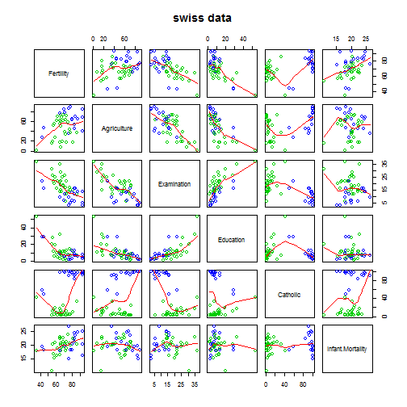

## Description

Standardized fertility measure and socio-economic indicators for each of 47 French-speaking provinces of Switzerland at about 1888.

--- .class #id 

## Format

A data frame with 47 observations on 6 variables, each of which is in percent, i.e., in [0, 100].

[,1]   Fertility	Ig, 'common standardized fertility measure'

[,2]	 Agriculture	 % of males involved in agriculture as occupation

[,3]	 Examination	 % draftees receiving highest mark on army examination

[,4]	 Education	 % education beyond primary school for draftees.

[,5]	 Catholic	 % 'catholic' (as opposed to 'protestant').

[,6]	 Infant.Mortality	 live births who live less than 1 year.

All variables but 'Fertility' give proportions of the population.

--- .class #id

## Details

(paraphrasing Mosteller and Tukey):

Switzerland, in 1888, was entering a period known as the demographic transition; i.e., its fertility was beginning to fall from the high level typical of underdeveloped countries.

The data collected are for 47 French-speaking "provinces" at about 1888.

Here, all variables are scaled to [0, 100], where in the original, all but "Catholic" were scaled to [0, 1].

--- .class #id

## Examples


```r
require(stats); require(graphics)
pairs(swiss, panel = panel.smooth, main = "swiss data",
      col = 3 + (swiss$Catholic > 50))
```

 

```r
summary(lm(Fertility ~ . , data = swiss))
```

```
## 
## Call:
## lm(formula = Fertility ~ ., data = swiss)
## 
## Residuals:
##     Min      1Q  Median      3Q     Max 
## -15.274  -5.262   0.503   4.120  15.321 
## 
## Coefficients:
##                  Estimate Std. Error t value Pr(>|t|)    
## (Intercept)       66.9152    10.7060    6.25  1.9e-07 ***
## Agriculture       -0.1721     0.0703   -2.45   0.0187 *  
## Examination       -0.2580     0.2539   -1.02   0.3155    
## Education         -0.8709     0.1830   -4.76  2.4e-05 ***
## Catholic           0.1041     0.0353    2.95   0.0052 ** 
## Infant.Mortality   1.0770     0.3817    2.82   0.0073 ** 
## ---
## Signif. codes:  0 '***' 0.001 '**' 0.01 '*' 0.05 '.' 0.1 ' ' 1
## 
## Residual standard error: 7.17 on 41 degrees of freedom
## Multiple R-squared:  0.707,	Adjusted R-squared:  0.671 
## F-statistic: 19.8 on 5 and 41 DF,  p-value: 5.59e-10
```

--- .class #id

## Source and References

<i>Project "16P5", pages 549-551 in

Mosteller, F. and Tukey, J. W. (1977) Data Analysis and Regression: A Second Course in Statistics. Addison-Wesley, Reading Mass.

indicating their source as "Data used by permission of Franice van de Walle. Office of Population Research, Princeton University, 1976. Unpublished data assembled under NICHD contract number No 1-HD-O-2077."</i>

<b>Becker, R. A., Chambers, J. M. and Wilks, A. R. (1988) The New S Language. Wadsworth & Brooks/Cole.</b>

